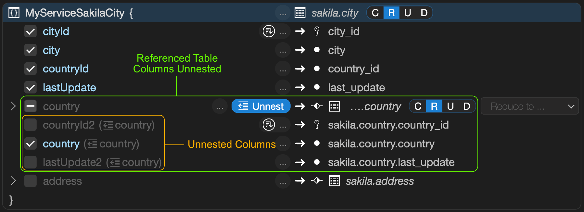

# MRS 开发者指南

本书解释了如何安装和配置 MySQL REST 服务（MRS）以及如何通过 REST 调用访问数据。

章节概览

[TOC]

另请参见

- MySQL REST 服务 - SQL 参考 - 本书讨论了 MySQL REST 服务 SQL 扩展。
- MySQL REST 服务 - 核心 REST API - 本书提供了使用 MySQL REST 服务查询和对表及视图进行其他操作的示例，这些表和视图在您启用了 REST 后可以使用。
- MySQL REST 服务 - SDK 参考 - 本书解释了如何使用 MRS 软件开发工具包，并讨论了客户端 API。

## 1 MySQL REST 服务简介

欢迎使用 MySQL REST 服务（MRS）。它提供了一种快速且强大的方式，通过 HTTPS REST 接口将数据提供给客户端应用程序。

要开始动手操作，请参见 MRS 注释示例，并按照那里的构建和部署指令操作。

本节提供了 MySQL REST 服务及其特性的概览。

### 关于 MySQL REST 服务

MySQL REST 服务（MRS）提供对选定 MySQL 模式对象的 HTTPS REST 访问。它在模型上仿照并支持 Oracle REST 数据服务（ORDS）的一个子集。

有关更多信息，请参见 [ORDS](https://docs.oracle.com/en/database/oracle/oracle-rest-data-services/22.2/orddg/introduction-to-Oracle-REST-Data-Services.html#GUID-A16BCCA2-8081-4062-A635-9F7C36FC394F/)

MRS 由以下组件组成：

- 一个 MySQL 解决方案（如 MySQL Heatwave、MySQL InnoDB 集群、独立的 MySQL 服务器等）
  - 提供一个包含 MRS 配置的元数据模式 `mysql_rest_service_metadata`
  - 提供应用程序的数据
- MySQL 路由器
  - 一个或多个 MySQL 路由器实例，通过默认端口 8443 提供 HTTPS REST 接口
- MySQL Shell / MySQL Shell for VS Code
  - 支持通过嵌入 VS Code 内部的图形用户界面（GUI）管理 MRS
  - MRS 插件，用于在终端上配置和管理 MRS 设置，并使用脚本

### 关于 REST API

表现状态转移REST（Representational State Transfer）是一种用于分布式超媒体系统（如万维网）的软件架构风格。当一个 API 符合 REST 的原则时，它被描述为 RESTful。虽然完全讨论 REST 超出了本文档的范围，但 REST API 具有以下特点：

- 数据被建模为一组资源。资源由 URI 标识。
- 使用一小组统一的操作来操纵资源（例如，PUT、POST、GET、DELETE）。
- 资源可以有多种表示（例如，一个博客可能有 HTML 表示和 RSS 表示）。
- 服务是无状态的，因为客户端可能需要访问相关资源，这些资源应在返回的表示中标识，通常通过提供超文本链接来实现。

**特性概览**

| 特性                   | 描述                                                         |
| ---------------------- | ------------------------------------------------------------ |
| MRS AutoREST           | 启用对表、视图或过程的 REST 访问，允许通过 RESTful 服务访问它们。AutoREST 是一种快速简便的方式，可以将数据库表暴露为 REST 资源。 |
| JSON-关系双重视图      | 双重视图结合了关系模式的优势和文档数据库的易用性。它们为您的数据提供了概念上和操作上的双重性，因为它既是以关系形式组织的，也是以层次形式组织的。 |
| 提供静态内容           | 除了使用 AutoREST 提供动态内容外，还可以上传静态内容，如 HTML、CSS 和图像文件。这个功能并不意味着要替代支持服务器端编程等能力的专用 HTTP 服务器。它可以帮助快速部署原型和概念验证工作，帮助将想法变为现实。 |
| 终端用户认证           | MRS 支持多种认证方法，包括 MRS REST 服务特定认证、原生 MySQL 认证和 OAuth2 认证（使用 Facebook 和 Google 登录） |
| 终端用户授权           | 内置支持行级安全、基于角色的安全、基于用户层次的安全、基于组的安全、基于组层次的安全以及自定义授权支持 |
| REST 服务 SDK API 生成 | 为交互式原型制作提供实时 SDK API 更新，使用 TypeScript 进行交互式原型制作，为应用程序开发生成 SDK API |

## 2 部署架构

MySQL REST 服务（MRS）可以根据个别项目需求以多种不同的方式部署。

### 开发部署

最小的可能开发环境由一个运行在同一台机器上的单个 MySQL 服务器实例和一个 MySQL 路由器实例组成。
推荐的开发部署包括使用至少三个 MySQL 服务器实例和两个 MySQL 路由器实例部署的 InnoDB 集群。
对于基于云的开发，应使用启用了高可用性功能的 MySQL 数据库服务实例和两个带有 MySQL 路由器部署的计算实例。

### 生产部署

在生产环境中，应使用设置了三个或更多 MySQL 路由器实例的 InnoDB 集群。推荐使用负载均衡器将 MySQL 路由器实例的 HTTPS 端口暴露给公共互联网。
对于生产中的基于云的开发，应使用启用了高可用性功能的 MySQL 数据库服务实例和三个或更多带有 MySQL 路由器部署的计算实例。推荐使用负载均衡器将 MySQL 路由器的 HTTPS 端口暴露给公共互联网。


MySQL REST 服务架构图

## 3 配置 MySQL REST 服务

要配置 MySQL REST 服务（MRS），请使用以下步骤：

1. 部署 MySQL 解决方案。
2. 配置 MRS 元数据数据库模式。
3. 引导并运行一个或多个支持 MRS 的 MySQL 路由器实例。

执行这些步骤后，MySQL REST 服务即完全配置完成。
然后可以按照在 MySQL 路由器引导过程中配置的方式访问 HTTP/S 端点。

### 部署 MySQL 解决方案

支持以下 MySQL 解决方案：

- MySQL HeatWave
- MySQL InnoDB Cluster
- MySQL InnoDB ClusterSet
- MySQL InnoDB ReplicaSet
- MySQL Operator

对于开发目的，也支持单独的 MySQL 服务器实例。因为它不提供任何形式的高可用性（HA），所以避免在生产部署中使用单独设置。

- 独立的MySQL 服务

请参见相应文档了解如何部署和配置不同的 MySQL 解决方案。

### 3.1 配置 MRS 元数据模式

MySQL REST 服务将其配置存储在 `mysql_rest_service_metadata` 数据库模式中。要部署元数据模式，请执行本节中描述的任务之一。

> **注意**
>
> 用于连接到 MySQL 解决方案的 MySQL 用户必须具有创建数据库模式和角色的 MySQL 权限。

#### 3.1.1 使用 VS Code 的 MySQL Shell 配置 MRS

启动 VS Code，安装 MySQL Shell for VS Code 扩展，然后添加数据库连接到 MySQL 设置。
右键点击 DATABASE CONNECTIONS 视图中的连接并选择 Configure Instance for MySQL REST Service Support。


现在已配置 MRS 元数据模式。

#### 3.1.2 使用 MySQL Shell 配置 MRS

1. 打开终端，启动 MySQL Shell 并连接到 MySQL 设置。

  ```shell
  mysqlsh dba@localhost
  ```
2. 使用 MRS 插件执行 `mrs.configure()` 来配置元数据模式。

  ```mysql
  MySQL> localhost:33060+> JS> mrs.configure()
  MySQL Rest Data Service configuration.

  Checking MRS metadata schema and version...
  Creating MRS metadata schema...
  The MRS metadata is well configured, no changes performed.
  ```
现在已配置 MRS 元数据模式。

### 3.2 用 MRS 支持引导和运行 MySQL 路由器

MySQL 路由器是任何 MySQL 解决方案的重要组成部分，因此通常与 MySQL 服务器实例一起部署。有关更多详细信息，请参见 MySQL 路由器文档。

需要配置 MySQL 路由器实例以支持 MRS。通常通过使用 `mysqlrouter_bootstrap` 命令完成，该命令会查询用户账户以获取必要信息。

#### 3.2.1 使用 VS Code 的 MySQL Shell 引导和运行 MySQL 路由器

在本地开发设置中工作时，通常会在本地开发机器上安装 MySQL 路由器实例。

在这种情况下，可以使用 VS Code 的 MySQL Shell 来简化引导过程并启动 MySQL 路由器实例，操作如下：

1. 在本地开发机上下载并安装 MySQL 路由器包。
   - 如果不使用 macOS 的 DMG 或 Windows 的 MSI 包来安装 MySQL 路由器，请确保包含 MySQL 路由器二进制文件的目录位于系统 PATH 中。

2. 在 VS Code 的 MySQL Shell 内，展开 DATABASE CONNECTIONS 视图中的一个数据库连接，右键点击 MySQL REST Service 树项，然后选择 Start Local MySQL Router Instance。

   - 如果 MySQL 路由器尚未配置，引导操作将在集成的 VS Code 终端中运行，然后启动 MySQL 路由器。

   - 然后可以在 VS Code 终端中检查 MySQL 路由器的调试输出。

3. 要关闭 MySQL 路由器，请将焦点设置到显示调试输出的 VS Code 终端，并按 Ctrl + C。

> **注意**
>
> 上述任务仅适用于不使用 MySQL SSH 隧道或 MDS 隧道功能的经典 MySQL 连接。


在 MySQL 路由器被引导和启动之后，MRS 将在 `https://localhost:8443/<service-name>` 处可用。然后，您可以继续添加 REST 服务。

#### 3.2.2 从命令行引导 MySQL 路由器

部署新的 MySQL 路由器实例时，建议使用 `mysqlrouter_bootstrap` 命令来引导和配置路由器，包括 MRS 配置。对于为 MRS 支持重新配置现有的 MySQL 路由器实例也是如此。

```shell
mysqlrouter_bootstrap dba@127.0.0.1:3306 --mrs --directory ~/.mysqlrouter
```
按照命令行上的交互步骤配置路由器。

##### 手动创建 MySQL 用户账户以供 MySQL 路由器访问

使用 `mysqlrouter_bootstrap` 命令为 MRS 配置 MySQL 路由器时，可以自动创建本节中描述的用户账户。

如果您想手动管理所需的 MySQL 账户，则需要执行以下步骤：

1. 创建 MySQL 用户账户（或多个账户）

   - 如果只指定了一个账户，MySQL 路由器将使用它来同时访问 MRS 元数据模式和应用程序模式数据。这个账户必须具有 `mysql_rest_service_meta_provider` 和 `mysql_rest_service_data_provider` 角色。

   - 如果使用两个账户，MySQL 路由器将使用一个用于 MRS 元数据模式访问，另一个用于应用程序模式数据访问。将 `mysql_rest_service_meta_provider` 角色分配给一个用户，将 `mysql_rest_service_data_provider` 分配给另一个用户。

2. 使用创建的 MySQL 账户引导 MySQL 路由器实例，并使用以下选项：

   - `--mrs-mysql-metadata-account` 路由器用来访问 MRS 元数据模式

   - `--mrs-mysql-data-account` 路由器用来访问应用程序模式

作为 MRS 元数据模式创建的一部分，为 MySQL 路由器访问 MySQL 创建了两个 SQL 角色：
- `mysql_rest_service_meta_provider` 角色授予对所需 MRS 元数据模式表的访问权限。
- `mysql_rest_service_data_provider` 角色授予对应用程序数据库模式中服务的模式对象的访问权限。

要创建 MySQL 账户，请使用 MySQL Shell 或 VS Code 的 MySQL Shell 连接到 MySQL 设置并执行以下 SQL 语句：
```sql
CREATE USER 'mysqlrouter_mrs_<router_name>'@'<router_host>' IDENTIFIED BY 'password';
GRANT 'mysql_rest_service_meta_provider', 'mysql_rest_service_data_provider' TO 'mysqlrouter_mrs_<router_name>'@'<router_host>';
```
调用 `mysqlrouter_bootstrap` 命令时，可以使用为账户指定的用户名。

| 选项                                     | 描述                |
| ---------------------------------------- | ------------------- |
| `--mrs-mysql-metadata-account=USER_NAME` | 设置 MRS 元数据用户 |
| `--mrs-mysql-data-account=USER_NAME`     | 设置 MRS 数据用户   |

##### 向已配置的 MySQL 路由器配置中添加 MRS 配置

如果您的 MySQL 路由器实例已经配置好了，可以稍后再添加 MRS 配置。

要获取现有配置文件的路径，请执行 `mysqlrouter --help` 以显示路由器配置文件的确切位置。

以下是连接到单个开发服务器时的一个示例。

```ini
[DEFAULT]
logging_folder = /var/log/mysqlrouter
runtime_folder = /var/run/mysqlrouter
config_folder = /etc/mysqlrouter

[logger]
level = DEBUG

[routing:mrs_rw]
bind_address=0.0.0.0
bind_port=6446
destinations=10.0.1.135:3306
routing_strategy=round-robin
protocol=classic
```
要在路由器上启用 MRS 支持，需要将 `[http_server]` 部分和 `[rest_mrs]` 部分扩展到配置文件中。
建议使用 `mysqlrouter_bootstrap` 命令为 MRS 配置路由器。
```shell
mysqlrouter_bootstrap dba@127.0.0.1:13000 --mrs --directory /export/mysql/src/mysql-trunk/boot
```
这些参数可用于设置 MRS 配置选项。

| 选项                                     | 描述                                             |
| ---------------------------------------- | ------------------------------------------------ |
| `--mrs`                                  | 包括 MRS 配置                                    |
| `--mrs-mysql-metadata-account=USER_NAME` | 设置 MRS 元数据用户                              |
| `--mrs-mysql-data-account=USER_NAME`     | 设置 MRS 数据用户                                |
| `--mrs-global-secret=SECRET`             | 全局 JWT 密钥必须对每个 MySQL 路由器安装保持一致 |

以下示例演示了连接到单个开发服务器并使用 HTTP 服务 REST 服务。
```ini
[http_server]
port=8443
ssl=1
ssl_cert=/Users/myUser/.mysqlsh/plugin_data/gui_plugin/web_certs/server.crt
ssl_key=/Users/myUser/.mysqlsh/plugin_data/gui_plugin/web_certs/server.key

[mysql_rest_service]
mysql_read_only_route=bootstrap_ro
mysql_read_write_route=bootstrap_rw
mysql_user=mysql_router_mrs16_250ho3u15n
mysql_user_data_access=
router_id=16
```

## 4 添加 REST 服务和数据库对象

MRS 支持设置大量的 REST 服务。

每个 REST 服务都有其自己的设置，包括 URL 路径、主机名、支持的协议、身份验证选项和其他设置。服务可以暴露选定的数据库架构和对象列表。

可以为每个应用程序执行单独的设置，并建议为每个应用程序设置一个单独的 REST 服务。

### 添加 REST 服务的前提条件

在设置新的 REST 服务之前，请确保满足以下前提条件：

- 必须在目标 MySQL 解决方案上配置 MySQL REST 服务。请参见本手册的配置部分。
- 用于连接到目标 MySQL 解决方案的 MySQL 账户需要被授予 `mysql_rest_service_admin` MySQL 角色或权限的超集。

要授予 `mysql_rest_service_admin` MySQL 角色，请执行以下 SQL 语句。

```mysql
GRANT 'mysql_rest_service_admin' TO 'user_account'@'%';

-- 请确保在下一个语句中包含所有应在用户连接时激活的角色
ALTER USER 'user_account'@'%' DEFAULT ROLE 'mysql_rest_service_admin';
```
### 4.1 设置新的 REST 服务

可以通过以下方式之一添加新的 REST 服务：

- MySQL Shell for VS Code 提供了一个 GUI 对话框来创建 REST 服务。
- MySQL Shell 提供了 MRS 插件，可以用来在终端中交互式地或通过脚本创建 REST 服务。
- 编写 MySQL Shell 的脚本或插件时，可以使用 MRS 插件以 Python 或 JavaScript 脚本化创建过程。

#### 4.1.1 使用 MySQL Shell for VS Code 添加 REST 服务

在目标 MySQL 实例上配置 MySQL REST 服务后，DATABASE CONNECTIONS 视图中的 DB Connection 展开后会显示一个新的树项，MySQL REST Service。

- 右键点击树项 MySQL REST Service 并从列表中选择 Add REST Service... 来显示 MySQL REST Service 对话框。
- 指定所需参数的值，然后点击 OK 添加新的 REST 服务。


添加 REST 服务

#### 4.1.2 使用 MySQL Shell 添加 REST 服务

对于 MySQL Shell，使用 mrs 插件来处理 MySQL REST 服务。`mrs.add.service()` 函数用于添加新的 REST 服务。

如果没有参数启动，一个交互式向导会提示您输入所需参数。例如：

```mysql
MySQL > localhost:33060+ > Py > mrs.add.service()
Please enter the context path for this service [/mrs]: /myservice
Please enter the host name for this service (e.g. None or localhost) [None]:
   1 HTTP
   2 HTTPS

Please select the protocol(s) the service should support [HTTP,HTTPS]: 2
Comments:
   1 Default Service Options for Development
   2 No options
   3 Custom options

Please select how to initialize the options [Default Service Options for Development]:

Service /myservice created successfully.
```
执行以下命令以获取有关 `mrs.add.service()` 函数的详细帮助信息。
```
\? mrs.add.service
```
#### 4.1.3 REST 服务定义

##### 4.1.3.1 关于 MRS AutoREST

AutoREST 是一种快速简便的方法，用于将数据库架构表、视图和过程作为 REST 资源暴露。

##### 4.1.3.2 REST APIs

表征状态转移（REST）是一种用于分布式超媒体系统（如万维网）的软件架构风格。当 API 符合 REST 的原则时，被描述为 RESTful。虽然全面讨论 REST 超出了本文档的范围，但 REST API 具有以下特征：

- 数据被建模为一组资源。资源通过 URI 被识别。
- 使用一小组统一的操作来操作资源（例如，PUT、POST、GET、DELETE）。
- 资源可以有多种表示（例如，博客可能有 HTML 表示和 RSS 表示）。
- 服务是无状态的，由于客户端可能希望访问相关资源，这些资源应在返回的表示中被识别，通常通过提供超文本链接来实现。

##### 4.1.3.3 RESTful 服务术语

本节介绍本文档中使用的一些常见术语：

- **RESTful 服务：**符合 RESTful 架构风格原则的 HTTP 网络服务。
- **资源模块：**用于对相关资源模板进行分组的组织单元。
- **资源模板：**能够为一组 URI（统一资源标识符）集合服务请求的个别 RESTful 服务。URI 集合由资源模板的 URI 模式定义。
- **URI 模式：**资源模板的模式。可以是路由模式或 URI 模板，尽管鼓励使用路由模式。
- **路由模式：**专注于将 URI 的路径部分分解为其组成部分的模式。例如，模式 /:object/:id? 将匹配 /emp/101（匹配对 id 为 101 的 emp 资源项的请求）并且也将匹配 /emp/（匹配对 emp 资源的请求，因为 :id 参数用 ? 修饰符标注，表示 id 参数是可选的）。

- **HTTP 操作：**HTTP（超文本传输协议）定义了可以对资源执行的标准方法：GET（检索资源内容）、POST（存储新资源）、PUT（更新现有资源）和 DELETE（移除资源）。

### 4.2 将数据库架构添加到 REST 服务

对于每个 MySQL 数据库架构，可以创建一个相应的 REST 架构并添加到 REST 服务。通过为 MySQL 数据库架构创建多个 REST 架构，可以将同一个 MySQL 数据库架构添加到不同的 REST 服务。

可以使用 MySQL Shell for VS Code 或命令行上的 MySQL Shell 创建 REST 架构。

注意：将数据库架构作为 REST 架构添加并不等同于通过 RESTful Web 服务暴露架构中的所有表和视图。这仅仅意味着让 MySQL REST 服务知道该架构的存在，以及它可能有零个或多个资源通过 HTTP/S 暴露。

#### 添加数据库架构和对象的前提条件

在添加 REST 架构和对象之前，请确保满足以下前提条件：

- 首先必须添加一个 REST 服务（见添加 REST 服务）。

- 用于连接到目标 MySQL 解决方案的 MySQL 账户需要被授予 `mysql_rest_service_schema_admin` MySQL 角色或权限的超集。

要授予 `mysql_rest_service_schema_admin` MySQL 角色，请执行以下 SQL 语句。

```mysql
GRANT 'mysql_rest_service_schema_admin' TO 'user_account'@'%';

-- 请确保在下一个语句中包含所有应在用户连接时激活的角色
ALTER USER 'user_account'@'%' DEFAULT ROLE 'mysql_rest_service_schema_admin';
```
#### 4.2.1 通过 MRS DDL 添加架构

在活动的 MySQL Shell 连接上执行 CREATE REST SCHEMA DDL 语句，引用 FROM 子句中的对应 MySQL 数据库架构。有关更多详情，请参见 MRS SQL 参考。

**示例**

以下示例为 REST 服务 /myService 添加了 sakila 数据库架构的 REST 架构。

```mysql
CREATE OR REPLACE REST SCHEMA /sakila ON SERVICE /myService
    FROM `sakila`
    COMMENTS "The sakila schema";
```
#### 4.2.2 使用 MySQL Shell for VS Code UI 添加架构

要将数据库架构添加到 REST 服务：

- 右键点击 DATABASE CONNECTIONS 视图中的架构，然后选择 Add Schema to REST Service。这将打开一个对话框，可以在其中设置所有 REST 架构参数。
- 点击 OK 添加架构。


添加数据库架构

#### 4.2.3 使用 MySQL Shell 脚本添加 REST 架构

要将数据库架构添加到 REST 服务，调用 `mrs.add.schema()` 函数。

如果没有参数启动，一个交互式向导会提示您输入所需参数。

```mysql
MySQL > localhost:33060+ > JS > mrs.add.schema()
   1 information_schema
   2 performance_schema
   3 sys
   4 sakila
   5 test
   6 forum
   7 ortho
   8 mrs_notes

Please enter the name or index of a schema: 4
Please enter the request path for this schema [/sakila]: /sakila
Should the schema require authentication [y/N]:
How many items should be listed per page [Schema Default]:
Comments:
Options:

Service with path /sakila created successfully.
```
执行以下命令以获取有关 `mrs.add.schema()` 函数的详细帮助信息。
```
\? mrs.add.schema
```
### 4.3 添加架构表、视图或过程

将数据库架构对象（表、视图或过程）添加到 MySQL REST 服务（MRS）允许通过 RESTful Web 服务访问它们。在可以将数据库架构对象添加为 REST 对象之前，包含这些对象的数据库架构必须被添加为 REST 架构。

以下图示显示了一个 REST 架构及其 REST 对象。


REST 架构及其对象

一旦将 MySQL 数据库架构添加为 REST 架构，就可以添加其对象。数据库架构表和视图被添加为 REST 双重视图，存储过程被添加为 REST 过程。

> 注意：REST 双重视图使应用程序开发人员在实现他们的应用程序时采取文档中心的方法。请参阅本文档的 JSON 双重视图部分，了解使用 REST 双重视图的优势。

可以使用 MySQL Shell for VS Code 或命令行上的 MySQL Shell 添加 MySQL 数据库架构对象。

#### 4.3.1 通过 MRS DDL 添加架构对象

在活动的 MySQL Shell 连接上执行 CREATE REST DUALITY VIEW DDL 语句将数据库架构表或视图添加为 REST 对象。有关更多详情，请参见 MRS SQL 参考。

要添加存储过程，可以使用 CREATE REST PROCEDURE DDL 语句。

**示例**

以下示例为 sakila.city 数据库架构表添加了一个 REST 双重视图。

```mysql
CREATE REST DUALITY VIEW /city
ON SERVICE /myService SCHEMA /sakila
FROM `sakila`.`city` AS MyServiceSakilaCity {
    cityId: city_id @SORTABLE,
    city: city,
    countryId: country_id,
    lastUpdate: last_update
};
```
下一个示例为 sakila.film_in_stock 数据库架构存储过程添加了一个 REST 过程。
```mysql
CREATE OR REPLACE REST PROCEDURE /filmInStock
FROM `sakila`.`film_in_stock` AS MyServiceSakilaFilmInStock
PARAMETERS {
    pFilmId: p_film_id @IN,
    pStoreId: p_store_id @IN,
    pFilmCount: p_film_count @OUT
}
RESULT MyServiceSakilaFilmInStock {
    inventoryId: inventory_id @DATATYPE("int")
};
```
#### 4.3.2 使用 MySQL Shell for VS Code UI 添加架构对象

要将数据库架构对象添加到 REST 架构：

- 右键点击 DATABASE CONNECTIONS 视图中的数据库对象，然后选择 Add Database Object to REST Service。这将打开 MySQL REST Object 对话框。
- 相应调整所有 REST 对象设置。
- 按 OK 添加数据库架构对象。


添加数据库对象

#### 4.3.3 使用 MySQL Shell 添加数据库对象

要将数据库架构添加到 REST 服务，调用 `mrs.add.dbObject()` 函数。
如果没有参数启动，一个交互式向导会提示您输入所需参数。

```mysql
MySQL > localhost:33060+ > JS > mrs.add.dbObject()
   1 mrs_notes
   2 sakila

Please enter the name or index of a schema: 2
   1 TABLE
   2 VIEW
   3 PROCEDURE

Please enter the name or index of a database object type [TABLE]:
   1 actor
   2 address
   3 category
   4 city
   5 country
   6 customer
   7 film
   8 film_actor
   9 film_category
  10 film_text
  11 inventory
  12 language
  13 payment
  14 rental
  15 staff
  16 store

Please enter the name or index of an database object: 4
Please enter the request path for this object [/city]:
   1 CREATE
   2 READ
   3 UPDATE
   4 DELETE

Please select the CRUD operations that should be supported, '*' for all [READ]:
   1 FEED
   2 ITEM
   3 MEDIA

Please select the CRUD operation format [FEED]:
Should the db_object require authentication [y/N]:
Should row ownership be required when querying the object [y/N]:
How many items should be listed per page [Schema Default]:
Comments:

Object added successfully.
```

执行以下命令以获取有关 `mrs.add.dbObject()` 函数的详细帮助信息。

```
\? mrs.add.dbObject
```
## 5 与 REST 服务交互式工作

MySQL Shell for VS Code 支持一种实时、交互式的工作流程，用于设计 REST 服务。

它允许开发者通过在 DB Notebook 内使用 MRS SDK TypeScript 客户端 API，立即测试他们新创建或修改的 REST 双重视图和 REST 过程。

### 交互式工作流的前提条件

- 需要引导并运行支持 MRS 的 MySQL Router 实例。在使用本地开发设置时，也可以直接在 VS Code 内完成此操作。

### 5.1 切换到 TypeScript 模式

在 MySQL Shell for VS Code 中打开数据库连接后，将显示 DB Notebook。如果它处于 SQL 模式，使用 \ts 将 DB Notebook 切换到 TypeScript 模式。


DB Notebook - 切换到 TS 模式

### 5.2 选择一个 REST 服务

为了在 DB Notebook 上使用 REST 服务，需要将其设置为当前 REST 服务。这类似于执行 SQL USE db_name 语句来设置当前数据库架构。

要获取当前 REST 服务的信息，请使用全局 mrs 对象并执行 mrs.getStatus() 函数。它将打印有关 MRS 状态的信息。当前 REST 服务将具有属性 isCurrent 设置为 true。
示例

```json
ts> mrs.getStatus();
{
    "configured": true,
    "info": "2 REST 服务可用。",
    "services": [
        {
            "serviceName": "myService",
            "url": "https://localhost:8443/myService",
            "isCurrent": true
        },
        {
            "serviceName": "myPublicService",
            "url": "https://localhost:8443/myPublicService",
            "isCurrent": false
        }
    ]
}
```
设置当前 REST 服务后，该服务的 MRS TypeScript 客户端 API 将自动生成并实时提供给 DB Notebooks 上的 TypeScript 代码块。

当前 REST 服务对象可以通过与 mrs.getStatus() 函数中 serviceName 属性列出的相同名称的全局变量直接访问。serviceName 直接从 REST 服务的 url 上下文根路径转换而来，通过将其转换为驼峰式并移除所有斜杠 /。例如，url 上下文根为 /myService 的 REST 服务将可通过 myService 访问。

**示例**

```json
ts> myService.url;
https://localhost:8443/myService
```
当前 REST 服务可以通过 DB Notebook 上的 TypeScript 或通过 VS Code UI 设置。

#### 5.2.1 使用 TypeScript 设置当前 REST 服务

全局 mrs 对象自动持有所有可用 REST 服务的属性。REST 服务属性的命名与上一节讨论的每个 REST 服务的 serviceName 匹配。

执行 mrs.<serviceName>.setAsCurrent() 函数使给定的 REST 服务成为当前服务。VS Code 的自动完成功能将协助选择 serviceName。

**示例**

```
ts> mrs.myPublicService.setAsCurrent();
```
> ***注意**：当前 REST 服务仅在执行完整的 TypeScript 代码块后可用，macOS 上使用 [command] + [Return]，Linux 和 Windows 上使用 [Ctrl] + [Return]。它使用异步消息管道，无法等待。因此，在更改当前 REST 服务的同一个代码块中尝试访问特定方法将不起作用。*

#### 5.2.2 使用 VS Code 设置当前 REST 服务

在 VS Code 的主边栏中浏览 DATABASE CONNECTIONS 视图，打开当前 DB 连接以及 MySQL REST Service 树项，右键点击所需的 MRS 服务并从上下文菜单中选择 Set as Current REST Service。


设置当前 REST 服务

当前 REST 服务由实心、填充的 REST 服务图标指示。所有其他 REST 服务仅使用带轮廓的图标。

### 5.3 身份验证

如果某些 REST 对象需要身份验证，并且已将 REST 身份验证应用添加到 REST 服务，请使用 REST 服务客户端 API 对象的 authenticate() 函数。这将显示一个登录对话框，可以在其中指定用户账户的凭据。

```
ts> myService.authenticate();
```
> *authenticate() 函数仅适用于内置的 MRS 身份验证供应商。添加 REST 身份验证应用时，请确保设置此供应商。*

### 5.4 查询 REST 对象

在以下示例中，如上图所示，使用了 sakila.city 数据库表。

```js
ts> myService.sakila.city.findFirst();
{
   "city": "A Corua (La Corua)",
   "links": [
      {
         "rel": "self",
         "href": "/myService/sakila/city/1"
      }
   ],
   "cityId": 1,
   "countryId": 87,
   "lastUpdate": "2006-02-15 04:45:25.000000",
   "_metadata": {
      "etag": "EE93452B41984F3F5BBB0395CCB2CED00F5C748FEEA4A36CCD749CC3F85B7CEA"
   }
}
```
字段可以被过滤，并且可以添加条件 where 子句。有关更多信息，请参阅 MRS SDK 客户端 API 文档。
```json
ts> myService.sakila.city.findMany({select: ["city", "cityId"], where: {city: {$like: "NE%"}}});
{
    "items": [
        {
            "city": "Newcastle",
            "links": [
                {
                    "rel": "self",
                    "href": "/myService/sakila/city/364"
                }
            ],
            "cityId": 364,
            "_metadata": {}
        },
        {
            "city": "Nezahualcyotl",
            "links": [
                {
                    "rel": "self",
                    "href": "/myService/sakila/city/365"
                }
            ],
            "cityId": 365,
            "_metadata": {
                "etag": "681C34301F6ED6FD1200505C9C2CFB90E3367A267B7AADBD85186D781FEC7C19"
            }
        }
    ],
    "limit": 25,
    "offset": 0,
    "hasMore": false,
    "count": 2,
    "links": [
        {
            "rel": "self",
            "href": "/myService/sakila/city/"
        }
    ]
}
```
要使用 REST 对象对话框快速编辑 REST DB 对象，可以使用 edit() 函数。请注意，此功能仅在 DB Notebooks 上可用。
```
ts> myService.sakila.city.edit()
```

## 6 JSON-关系双重视图

### 6.1 双重视图简介

双重视图结合了关系架构的优点和文档数据库的易用性。它们为您的数据提供了概念上和操作上的双重性，因为它既是关系性组织的，也是层次性组织的。您可以基于存储在一个或多个相同表中的数据创建不同的双重视图，提供相同共享数据上的不同 JSON 层次结构。这意味着应用程序可以将同一数据作为一组 JSON 文档或一组相关表和列来访问（创建、查询、修改），并且两种方法可以同时使用。

#### 6.1.1 使用案例

MySQL REST 服务为双重视图提供了完整支持。它们用于覆盖关系用例（1）以及文档中心用例（2）。

1. 通过 REST 端点使单个关系表或视图可用
   - 将表的行暴露为一组扁平的 JSON 文档
   - 允许应用程序在需要时使用传统的关系方法
2. 为一组相关的数据库架构表创建单个 REST 端点
   - 将相关表作为嵌套的 JSON 对象暴露在一组 JSON 文档中
   - 允许应用程序采取文档导向方法

下图可视化了这两种使用案例。


JSON 关系双重性 - 使用案例

#### 6.1.2 REST 双重视图工作流

在 MySQL REST 服务的范围内，JSON-关系双重视图作为 REST 双重视图暴露。可以使用 CREATE REST DUALITY VIEW MRS DDL 语句或使用 MySQL Shell for VS Code 扩展的 MRS 对象对话框交互式创建这些视图。

一旦创建了 REST 双重视图，使用 REST 访问它非常简单。适用以下工作流。

- 从 REST 双重视图中获取文档
- 对文档进行所需的任何更改，包括对嵌套的 JSON 对象的更改
- 将文档放回 REST 双重视图中

下图显示了典型的 JSON 文档更新周期。


JSON 关系双重性 - 更新周期

数据库自动检测新文档中的更改，并修改底层行，包括所有嵌套表。共享相同数据的所有双重视图立即反映此更改。这极大地简化了应用程序开发，因为与使用传统的文档数据库相比，开发者不再需要担心不一致性。

### 6.2 无锁乐观并发控制

双重视图可以在不使用锁的情况下安全地并发更新。从数据库获取的对象计算了一个校验和，称为 ETag，包含在返回对象的 _metadata.etag 字段中。

当该对象提交回 MRS 进行更新（通过 PUT)时，将比较原始对象的 ETag 和当前版本的 ETag。如果自首次获取对象以来对应行已更改，则 ETag 不匹配。在这种情况下，请求失败，HTTP 状态码为 412。客户端必须再次获取对象，并根据最新版本的对象重新提交其更新请求。

对象校验和包括源行的所有字段以及任何联接/包含的行，即使是过滤掉的字段。可以使用 @nocheck 属性显式排除字段。

**示例**

如果首次 `GET /myService/sakila/city/1` 向客户端返回以下 JSON 文档。

```json
{
    "city": "A Corua (La Corua)",
    "links": [
        {
            "rel": "self",
            "href": "/myService/sakila/city/1"
        }
    ],
    "cityId": 1,
    "country": {
        "country": "Spain",
        "countryId": 87,
        "lastUpdate": "2006-02-15 04:44:00.000000"
    },
    "countryId": 87,
    "lastUpdate": "2006-02-15 04:45:25.000000",
    "_metadata": {
        "etag": "FFA2187AD4B98DF48EC40B3E807E0561A71D02C2F4F5A3B953AA6CB6E41CAD16"
    }
}
```
接下来，客户端更新对象，将城市名称更改为 `A Coruña (La Coruña)` 并通过调用 `PUT /myService/sakila/city/1` 提交它。
```json
{
    "city": "A Coruña (La Coruña)",
    "links": [
        {
            "rel": "self",
            "href": "/myService/sakila/city/1"
        }
    ],
    "cityId": 1,
    "country": {
        "country": "Spain",
        "countryId": 87,
        "lastUpdate": "2006-02-15 04:44:00.000000"
    },
    "countryId": 87,
    "lastUpdate": "2006-02-15 04:45:25.000000",
    "_metadata": {
        "etag": "FFA2187AD4B98DF48EC40B3E807E0561A71D02C2F4F5A3B953AA6CB6E41CAD16"
    }
}
```
如果在 GET 和 PUT 请求之间目标对象已被更改（例如，由另一个用户），ETag 检查将失败，并且 PUT 将导致错误 412 Precondition Failed。

### 6.3 交互式双重视图设计

虽然可以通过手动编写 CREATE REST DUALITY VIEW MRS DDL 语句来创建 REST 双重视图，但在可视化编辑器中设计 REST 双重视图通常更容易。

MySQL Shell for VS Code 包括 MySQL REST 对象对话框，它具有高级的 JSON/关系双重设计师。使用这个设计师，可以在几秒钟内创建即使是复杂的、嵌套的 REST 双重视图。

DDL 预览按钮允许在交互式设计 REST 双重视图时预览相应的 MRS DDL 语句。

#### 6.3.1 构建 JSON/关系双重视图

为单个关系表（或视图）构建 REST 双重视图非常直接。使用 MySQL Shell for VS Code 添加数据库架构表会自动创建包含表中所有列的相应 REST 双重视图，这些列在一个扁平的 JSON 对象中。


JSON 关系编辑器

通过 VS Code 添加数据库架构表等同于调用没有 graphQlObj 定义的 CREATE REST DUALITY VIEW MRS DDL 语句，这也会将表的所有列作为一个扁平的 JSON 对象添加。

```sql
CREATE OR REPLACE REST DUALITY VIEW /city
FROM `sakila`.`city` AS MyServiceSakilaCity;
```
```sql
SHOW CREATE REST VIEW /city;
+-----------------------------------------------+
| CREATE REST DUALITY VIEW                      |
+-----------------------------------------------+
| CREATE OR REPLACE REST DUALITY VIEW /city     |
|     ON SERVICE /myTestService SCHEMA /sakila  |
|     AUTHENTICATION REQUIRED                   |
|     FROM sakila.city AS MyServiceSakilaCity { |
|         cityId: city_id,                      |
|         city: city,                           |
|         countryId: country_id,                |
|         lastUpdate: last_update               |
|     };                                        |
+-----------------------------------------------+
```
> ***注意：为了能够在不需要身份验证的情况下访问 REST 对象，需要在 MySQL REST 对象对话框中取消选中“需要认证”复选框，或者在 MRS DDL 语句中添加 AUTHENTICATION NOT REQUIRED 子句。这只应在开发时间或当 REST 端点应公开可用时才这样做。***

##### 6.3.1.1 启用 CRUD 操作

由于默认情况下只启用了 READ CRUD 操作（见关系对象旁边的高亮 R），因此只允许在 REST 对象上执行读取命令。要更改这一点，需要在 MySQL REST 对象对话框中切换每个 CRUD 字母（C - 创建，R - 读取，U - 更新和 D - 删除）以启用或禁用相应的功能。

通过在 MRS DDL 语句中使用注释可以达到相同的效果。
```sql
CREATE OR REPLACE REST DUALITY VIEW /city
FROM `sakila`.`city` @INSERT @UPDATE @DELETE AS MyServiceSakilaCity;
```
下表显示了 CRUD 操作和 SQL 操作之间的映射。
| 字母 | CRUD 操作 | SQL 操作 |
| ---- | --------- | -------- |
| C    | CREATE    | CREATE   |
| R    | READ      | SELECT   |
| U    | UPDATE    | UPDATE   |
| D    | DELETE    | DELETE   |

#### 6.3.2 创建嵌套的 JSON/关系双重视图

通过启用引用的表，该表的列将作为 JSON 结果中的嵌套条目包含。请注意，这适用于 1:1 和 1:n 关系。1!


添加引用的表

这将导致以下结果。

```json
myService.sakila.city.findFirst();
```
```json
{
    "city": "A Corua (La Corua)",
    "links": [
        {
            "rel": "self",
            "href": "/myService/sakila/city/1"
        }
    ],
    "cityId": 1,
    "country": {
        "country": "Spain",
        "countryId": 87,
        "lastUpdate": "2006-02-15 04:44:00.000000"
    },
    "countryId": 87,
    "lastUpdate": "2006-02-15 04:45:25.000000",
    "_metadata": {
        "etag": "FFA2187AD4B98DF48EC40B3E807E0561A71D02C2F4F5A3B953AA6CB6E41CAD16"
    }
}
```
#### 6.3.3 创建带有未嵌套引用表的 JSON/关系双重视图

如果应将引用表的列添加到上一级，则可以启用“取消嵌套”选项。



取消嵌套引用的表

这将导致以下结果。

```json
myService.sakila.city.findFirst();
```
```json
{
    "city": "A Corua (La Corua)",
    "links": [
        {
            "rel": "self",
            "href": "/myService/sakila/city/1"
        }
    ],
    "cityId": 1,
    "country": "Spain",
    "countryId": 87,
    "lastUpdate": "2006-02-15 04:45:25.000000",
    "_metadata": {
        "etag": "48889BABCBBA1491D25DFE0D7A270FA3FDF8A16DA8E44E42C61759DE1F0D6E35"
    }
}
```
#### 6.3.4 创建带有精简引用表的 JSON/关系双重视图

而不是取消选择所有不需要的列并取消嵌套所有列，可以使用“精简到...”下拉菜单选择应为减少操作选择的列。


精简引用的表

这将导致与上述查询相同的结果。

```json
myService.sakila.city.findFirst();
```
```json
{
    "city": "A Corua (La Corua)",
    "links": [
        {
            "rel": "self",
            "href": "/myService/sakila/city/1"
        }
    ],
    "cityId": 1,
    "country": "Spain",
    "countryId": 87,
    "lastUpdate": "2006-02-15 04:45:25.000000",
    "_metadata": {
        "etag": "48889BABCBBA1491D25DFE0D7A270FA3FDF8A16DA8E44E42C61759DE1F0D6E35"
    }
}
```

